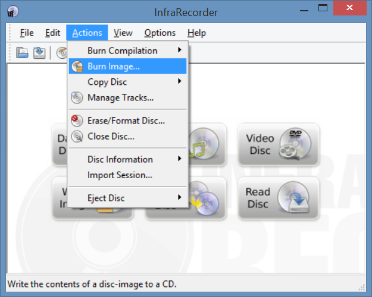
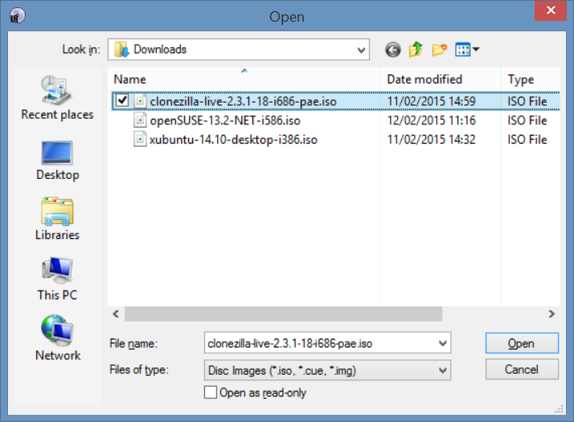
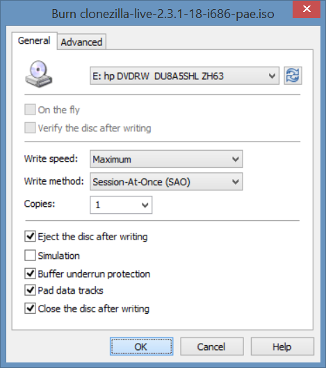
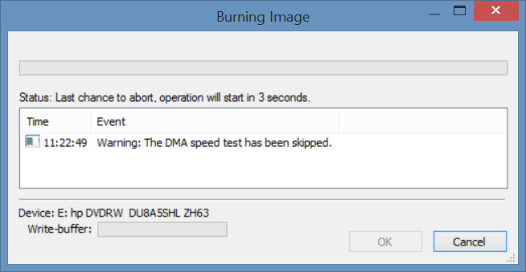
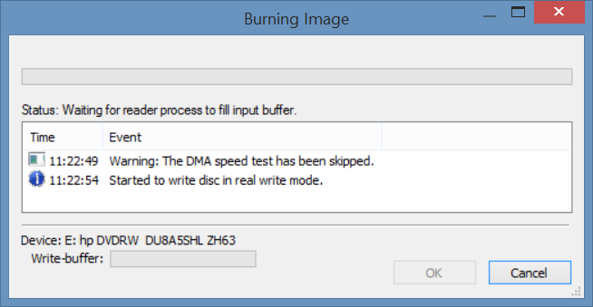
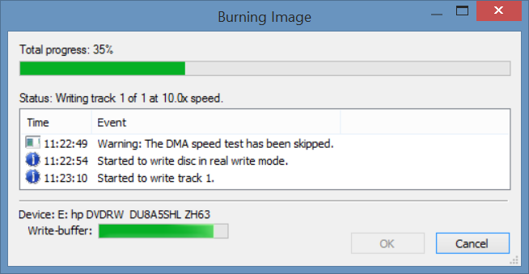
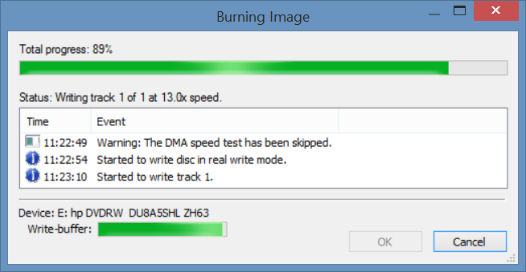
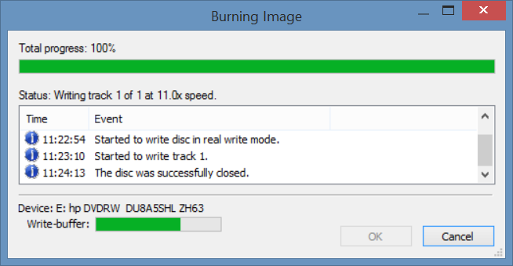
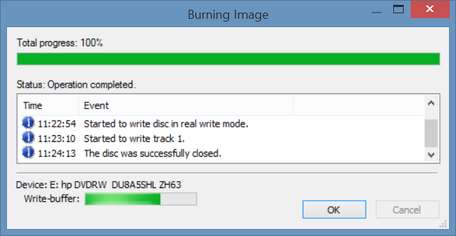

# Burn Clonezilla live CD

## Create Clonezilla live CD by InfraRecorder

To create bootable Clonezilla live CD on MS Windows with [InfraRecorder](http://infrarecorder.org/). Thanks to Victor Westmann for providing the screenshots.

1. Start the InfraRecorder program then choose `Actions` -> `Burn Image`:

   

2. Choose the Clonezilla live iso image file:

   

3. Choose the options to meet your requirement:

   

4. Start burning:

   

5. Burning process...:

   

6. Burning process...:

   

7. Burning process...:

   

8. Burning process...:

   

9. Burning process...:

   
