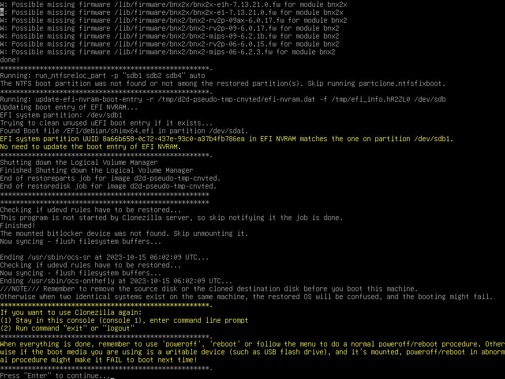

# Disk to disk clone

Disk to disk clone : Clone small disk to larger disk (e.g. 20 GB to 60 GB) (Step by step)

## Prepare Clonezilla live

> [!DANGER] Warning<!-- eslint-disable-line markdown/no-missing-label-refs -- GitHub alerts -->
> FIRST OF ALL, BACK UP IMPORTANT DATA BEFORE YOU USE CLONEZILLA LIVE TO DO ANYTHING.

In this example, the machine has 1 disk (20 GB with 8 GB data and 12 GB free space), we want to clone it to an external disk (60 GB). This is a normal case when you buy a new disk to replace old disk on your machine. Here since we use virtual machine to give this example, we use small disk size, i.e.

Besides, modern "light" laptop normally comes WITHOUT CD drive, or you happen to leave your USB CD drive in another place, it's a good idea to use USB device to boot Clonezilla live. In this example, we use a better, neater method, i.e. put Clonezilla live on the new disk and use it to boot clonezilla live. By doing this, you do not have to burn a CD, or prepare another USB flash drive. This is an one-time-use Clonezilla live, because later the clonezilla live files on new disk will be overwritten. Of course, you still can put Clonezilla live in CD or USB flash drive, then boot it to clone the 20 GB disk to 60 GB disk. The procedure is quite similar. Just remember to choose the correct source and destination disks.

> [!INFO] Prerequisite:<!-- eslint-disable-line markdown/no-missing-label-refs -- GitHub alerts -->
> A new, equal or larger disk, an external disk closure, a USB cable. A running MS Windows or GNU/Linux.

- Put the new disk inside your external disk closure, connect that to your running MS Windows or GNU/Linux via USB cable, then follow [here ** ISSUE: Replace liveusb url **](https://clonezilla.org//liveusb.php) to put Clonezilla live zip file on your external disk and make it bootable.
- Of coure, if your machine has the space to put 2 disks, the 2nd disk can be the internal disk, not necessary as the external disk.

## Boot your Clonezilla live via USB

- Insert the new hard drive (which is bootable with Clonezilla live builtin) with the USB cable to your machine.
- Most modern PC comes with USB boot function, you can refer to your motherboard manul to see how to set it during boot. E.g. On the Asus Zenbook, you can press ESC key and choose USB device to force the machine to boot via USB device.

## Choose `ToRAM` option in the boot menu

In the boot menu, we choose `(VGA 800x600 & To RAM)` or `(VGA with large font & To RAM)`

By doing this, all the Clonezilla live files on the new hard drive will be copied to RAM. Therefore, the partition of new hard drive can be released, i.e. it won't be busy and locked by running programs.

Press `Enter`, you will see Debian Linux booting process, and it will spend a few minutes when copying the files to RAM:

## Choose language

## Choose keyboard layout

The default keyboard layout is US keyboard, therefore if you are using US keyboard, just press enter (i.e. use the option `Keep`).

If you want to change keymap, you can choose `Change` then follow the dialog to change it.

## Choose `Start Clonezilla`

Choose `device-device`

Choose `Beginner`

If you choose `Expert` mode, you will have some chances to choose advanced parameters, e.g. tune the CHS values of target disk, how to create partition table on the target disk, etc.. You can see more details here.

> [!INFO] Note<!-- eslint-disable-line markdown/no-missing-label-refs -- GitHub alerts -->
> By default, Clonezilla will clone the `same` size of data from source to target disk. i.e. in this example, only 8 GB data will be cloned to the target disk. The remaining 12 GB on the source disk and the remaining 52 GB on the destination disk will not be read from or written to. If you want to make use all of the target disk size, remember to choose option `-k1` no matter in beginner or expert mode.

## Choose `disk_to_local_disk`

## Choose source disk

Here the source disk is `sda`, which is 20 GB in size, but only 8 GB data will be read. The remaining 12 GB free space is ignored.

> [!DANGER] Warning<!-- eslint-disable-line markdown/no-missing-label-refs -- GitHub alerts -->
> Be careful! Do not choose the wrong disk. Since all the data on the target disk will be overwritten!!!

## Choose target disk

Here the target disk is `sdb`, which is 60 GB in size but only 8 GB data will be written. The remaining 52 GB free space will be unchanged.

> [!DANGER] Warning<!-- eslint-disable-line markdown/no-missing-label-refs -- GitHub alerts -->
> Be careful! Do not choose the wrong disk. Since all the data on the target disk will be overwritten!!!

Select if the source file system needs to be checked or not:

Select if the way to create the partition table on the destination disk. Here we choose `-k0`:

Select the mode you want after the disk cloning is done:

By default we will choose later, but if you have decided, you can choose to reboot or poweroff the machine.

Clonezilla shows you the complete command to run this disk to disk clone action:

## Start cloning

Before doing the real cloning, Clonezilla will ask for confirmation:

Ask for confirmation again:

Now Clonezilla starts cloning, first it will prepare a pseudo image of source disk:

Then Clonezilla creates a partition table on the destination disk:

Clonezilla is cloning the data from source disk to destination disk:

## Disk is cloned

When everything is done, Clonezilla will prompt you if about reboot, poweroff, etc.

Then we choose `Poweroff`:

And the machine will be halted.

That's all. The new hard drive is ready to be used. You can remove the old (20 GB) disk from your machine, and put the new one (60 GB) in your machine. Boot it, you can enjoy the new disk.

> [!INFO] Note<!-- eslint-disable-line markdown/no-missing-label-refs -- GitHub alerts -->
> You can only keep one of the disks in the same machine before you boot it.

If you boot the machine with the source disk and the cloned destination disk on the same machine, the booting OS will be confused since there are two identical file systems on the same machine. They have the same UUID so the booting OS might mount the wrong file system.
