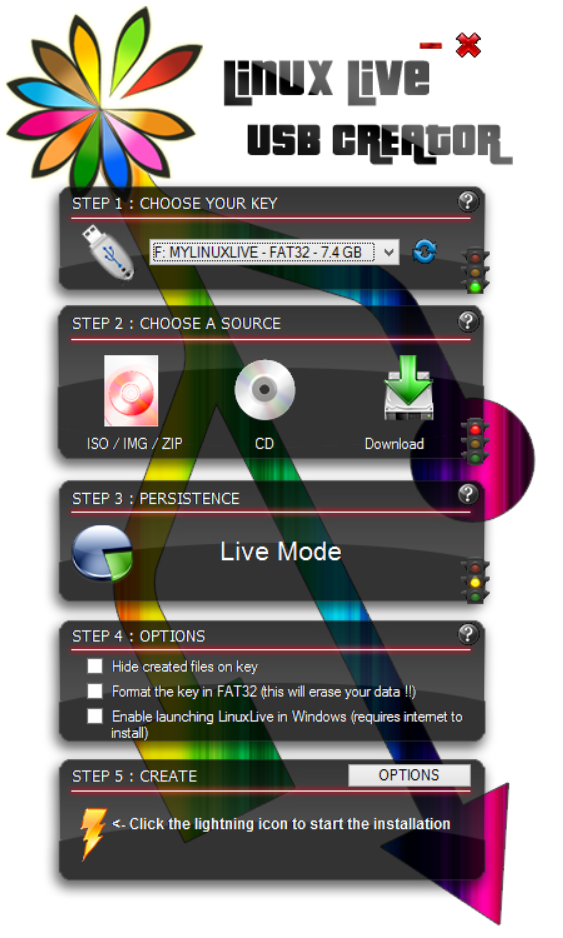

# LinuxLive USB creator

Create Clonezilla live USB flash drive by LinuxLive USB creator

## Create Clonezilla live USB flash drive by LinuxLive USB creator

The method D about creating bootable Clonezilla live USB flash on MS Windows with [LinuxLive USB Creator](https://www.linuxliveusb.com/). Thanks to Victor Westmann for providing the screenshots.

1. Start the LinuxLive USB creator program:

   

2. LinuxLive USB creator lists the 5 steps:

   

3. Follow the prompt for step 1 to choose the destination USB key:

   

4. The destination USB key has been chosen:

   

5. Now step 2, choose the Clonezilla live ISO file:

   

6. LinuxLive USB creator is checking the iso file:

   

7. The iso file check has been done:

   

8. Choose to format the USB key if you like:

   > [!DANGER] Warning<!-- eslint-disable-line markdown/no-missing-label-refs -- GitHub alerts -->
   > All the data on USB key will be erased

   

9. LinuxLive USB creator gives the warning!

   

10. LinuxLive USB creator is extracting the files from iso image:

11. LinuxLive USB creator is writing the files to USB key:

12. Finished!

