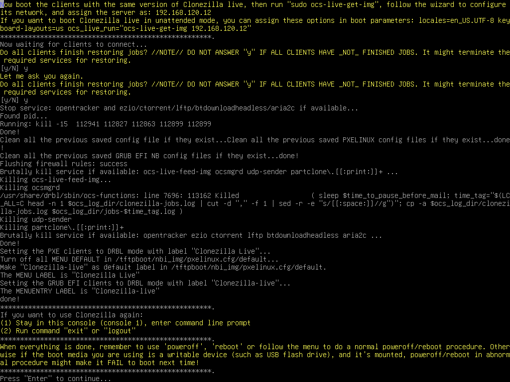

# lite server BT from dev

Run a Clonezilla lite server to do massive deployment from raw device via bittorrent mechanism

## Boot the machine via Clonezilla live

In this example, we will replicate the OS on the first hard drive (/dev/sda) in Machine A to other 30 client machines. Hence we will make Machine A as a Clonezilla lite server. Assume we already have an OS on Machine A's /dev/sda, and this OS will be replicated to other computers using Bittorrent mechanism. The nice thing about this method is we do not have to take an image from the raw device of Machine A then replicate the image to other machines. Hence this method will save a lot of time. We will use the existing DHCP service in the LAN when providing network booting service for clients.

Here we describe the details. Once you have the bootable Clonezilla Live CD/DVD or USB flash drive, you can boot the Machine A via Clonezilla live. **Remember to use the Clonezilla live CD or USB flash drive to boot the machine**d. For example, if you have Clonezilla Live in USB flash drive, you have to boot it via USB device (Ex. USB-HDD or USB-ZIP). If necessary, you can set the first boot priority in the BIOS as USB-HDD or USB-ZIP so that it can boot Clonezilla Live from your USB flash drive.

Here we take CD as an example. You can either set CD as first boot priority in machine's BIOS like this:

Or by pressing a hotkey (e.g. Esc or F9) when you boot the machine, you will see the boot menu of BIOS like this:

Check your motherboard manual for more details about how to boot your machine via CD.

## The boot menu of Clonezilla live

Here is a screenshot of Clonezilla Live boot menu:

The first one is the default mode for Clonezilla Live. It will default to framebuffer mode with a resolution of 800x600.

The 2nd one `(VGA 800x600 & To RAM)`, is the same function with the 1st one except when Clonezilla live booting finishes, all the necessary files are copied to memory. Therefore you can remove the boot media (CD or USB flash drive) then. In addition to use the arrow key to choose, you can also press "r" to choose that.

The 3rd one `(VGA with large font & To RAM)` is for you to use large font, especially when you have 4K monitor, and it will all the necessary files will be copied to memory. In addition to use the arrow key to choose, you can also press "l" to choose that.

The 4th one `(Speech synthesis)` is for the blind to use, which can be chosen by pressing "s" key.

There are more modes which you can choose in the 5th choice `Other modes of Clonezilla live`, e.g. 1024X768 or 640x480 one if you want, as shown here:

The choice, `KMS` is for you to use [KMS (Kernel Mode Setting)](https://en.wikipedia.org/wiki/Kernel_mode-setting) for your graphics card. If you have some problem to use the framebuffer mode of your graphics card, you can try it.

If you do not need Chinese, Japanese or Korean environment or if your computer experiences problems in the framebuffer mode, you can choose the one `Clonezilla Live Safe graphic settings (vga=normal)` to clone in the English environment.

The choice, `Clonezilla live (Failsafe mode)`, is for something goes wrong when you are not be able to boot your machine, such as ACPI of your machine is not supported in the kernel.

If you want to boot local OS in your hard drive, you can choose the one `Local operating system in hard drive (if available)`. This is an extra function in the boot media that has nothing to do with Clonezilla Live.

The choice, `Memtester (VGA 800x600 & To RAM)` is for memory testing using [Memtester](https://github.com/jnavila/memtester). This is an extra function in the boot media that has nothing to do with Clonezilla Live.

The choice, `Memory test using Memtest86+,` is for memory testing using [Memtest86+](https://www.memtest.org/). This is an extra function in the boot media that has nothing to do with Clonezilla Live.

The choice, `Network boot via iPXE` is used to perform a network boot via [iPXE](https://ipxe.org/). If your computer does not have a PXE network, you can use this to do boot from a network. This is an extra function in the boot media that has nothing to do with Clonezilla Live.

The choice, `uEFI firmware setup` is used to enter uEFI BIOS settings.

## Here we choose 800x600 mode, after pressing Enter, you will see Debian Linux booting process

## Choose language

## Choose keyboard layout

The default keyboard layout is US keyboard, therefore if you are using US keyboard, just press enter (i.e. use the option `Keep the default keyboard layout - US keyboard`).

If you want to change keyboard layout, you can choose `Change keyboard layout`, then follow the dialog menu to change that.

## Choose `Start Clonezilla`

## Choose `lite-server` option

Start Clonezilla lite server Now choose start Clonezilla lite server:

Decide the client machine booting mechanism. Here we choose clients will boot from network (PXE or uEFI network booting):

Here we choose to detect DHCP service automatically. If the existing one is found, we can reuse it. Otherwise we have to start our own DHCP service:

So now Clonezilla lite server will detect the existing DHCP service. Once it is found, the Clonezilla lite server will borrow (reuse) the existing service, i.e., relay the client's DHCP request to the existing DHCP server:

The existing DHCP service in the LAN has been detected, so now Clonezilla lite server will relay the client's DHCP request to existing DHCP service.

> [!INFO] Note <!-- eslint-disable-line markdown/no-missing-label-refs -- GitHub alerts -->
> Pay attention to the prompt. You have to make sure the DHCP service will provide enough IP addresses to all the clients. Besides, this mechanism is risky because all the PXE or uEFI network booting clients will enter DRBL or Clonezilla mode. Please make sure this is what you want.

## Mount the image repository.

Although in this scenario, there is no need to take an image, yet still we have to mount the image repository so that the temporary image for BT from device mode can be saved. This `pseudo` image only contains some metadata files, and it contains no real data from the device /dev/sda.

The best choice here is to choose `ram_disk` option to assign the RAM disk as the image home since it's usually faster then local disk or any other options:

## Choose the massive deployment mode using BT from raw device mode.

If you choose `Expert` mode, you will have some chances to choose advanced parameters, e.g. imaging program, compression program, etc.. You can see more details [here](#the-advanced-parameters-for-restoring-mode).

### The advanced parameters for restoring mode

::: details Click to view the content
Select advanced parameters

Choose the extra parameters you want. Here we just press enter to accept the default settings:

Choose the option `-k0` (Use the partition table from image)

If the target disk size is larger than the size of source disk of image, you can try to use option `-k1` which will create the partition table proportionally in the target disk and turn on option `-r` to resize the file file system in the partition automatically. This is useful to make use all of the target disk size.

If the destination disk is smaller than the source disk, if using beginner mode, you will see an error message like this (attempting to restore an image saved from 17.1 GB to a smaller disk (8.5 GB):

If you are sure all the data from the image could fit the smaller disk, i.e. it won't be written to the wrong disk space, you can check the option `-icds`.

> [!WARNING] Warning <!-- eslint-disable-line markdown/no-missing-label-refs -- GitHub alerts -->
> To select this option, you have to know what you are doing!

**ISSUE: FAQ/Q&A link missing**

For more details about the advanced parameters of Clonezilla live, you can also check this [FAQ/Q&A](http://drbl.org/faq/fine-print.php?path=./2_System/88_mbr_related_options.faq#88_mbr_related_options.faq).
:::

Since we will do massive deployment, now choose `massive-deployment`:

As described in the beginning, we'd like to replicate the OS on the raw device /dev/sda to other client machines, so now choose `from-device`:

Now select `disk-2-mdisks` option because we want to replicate the OS on the whole disk, not only some partitions:

## Select source disk.

Choose local source disk `sda` on Machine A which we want to replicate to other clients:

Choose to check the source file system integrity before really replicating it to other machines:

It's recommended to check the file system before replicating it because you do not know if the file system is broken or not. If you are very sure that the integrity is OK, then of course you can choose `-sfsck` to skip checking.

Select the mode you want after the image restoring is done in the client machines:

By default we choose `-p reboot` here. But if you have decided, you can choose poweroff the machine, choose in the client when the clone finishes, or do nothing after is restored.

Select to use multicast, broadcast or bittorrent mechanism. Here we take bittorrent mode:

> [!INFO] Note <!-- eslint-disable-line markdown/no-missing-label-refs -- GitHub alerts -->
> From Clonezilla live >= 3.1.1, you can also choose multicast or broadcast mode to do massive deployment from raw device.

Since we choose to check the file system on the source disk before deploying, now Clonezilla will check the file system integrity:

Clonezilla will prompt us the command to replicate the source disk using BT mechanism. This command is very useful when you want to create a customized Clonezilla live. In addition, it now starts all the services on the server and wait for the network booting clients to boot and receive the data to replicate to the disk /dev/sda:

As described in the screen, **only when all clients have finished jobs you can press `y` to terminate the required services**. Do not press `y` if there are some clients still restoring.

Now you can boot the client machine via PXE or uEFI network booting to receive the image and write to its disk /dev/sda. All the steps in the client machine should be in unattended mode.

Once all the clients are done, you can press `y` twice to terminate the required services:

Check the prompt in the end. Once you press `Enter`, Clonezilla will show you the prompt to poweroff, reboot, or rerun...

