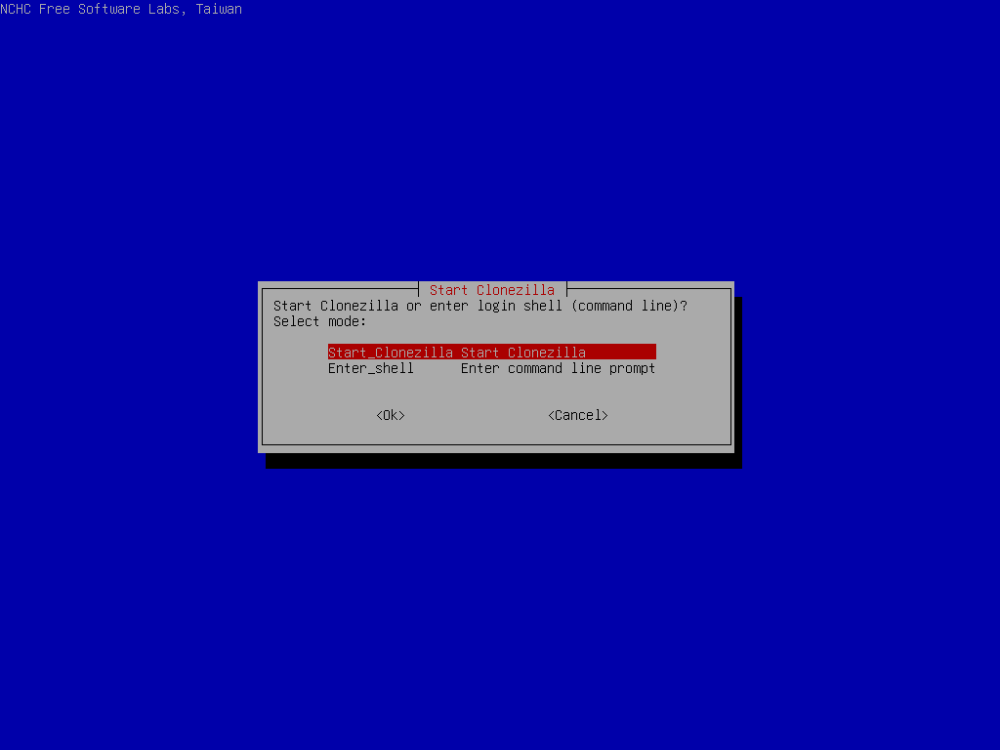
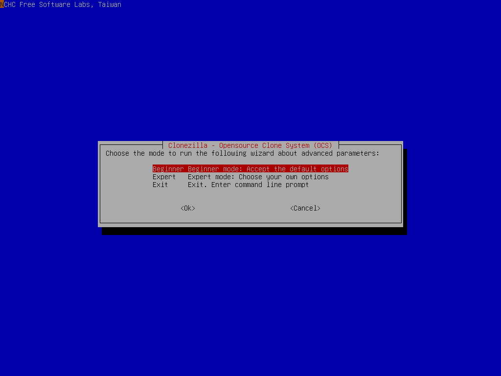
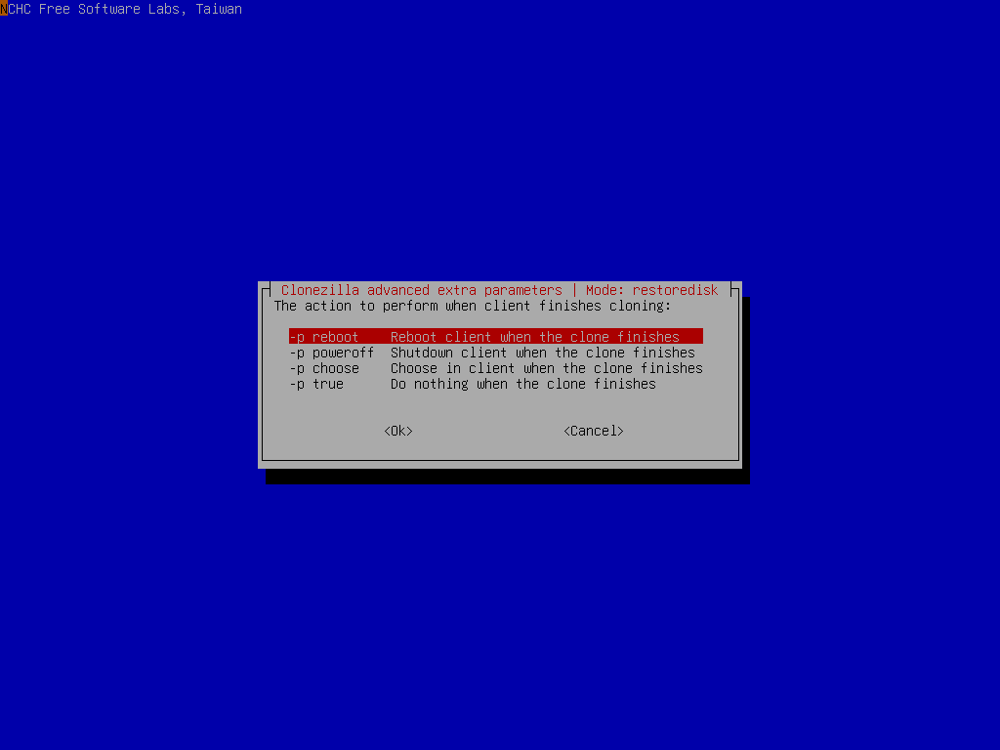

# lite server

Run a Clonezilla lite server to do massive deployment from an image via multicast mechanism

## Boot the machine via Clonezilla live

In this example, the machine will run as a Clonezilla lite server, which can be used to deploy an image to many computers. Assume we already have a Clonezilla image in sdb, the image name is called `bookworm-2023-10-15-03-img` and will be deployed to other computers using multicast mechanism. We will use the existing DHCP service in the LAN when providing network booting service for clients:

```text
root@debian:/home/partimag# ls -l
total 20
drwxr-xr-x 2 root root  4096 Oct 15 03:33 bookworm-2023-10-15-03-img
drwx------ 2 root root 16384 Oct 15 02:47 lost+found

root@debian:~# ls -lh /home/partimag/bookworm-2023-10-15-03-img/
total 1.3G
-rw-r--r-- 1 root root  901 Oct 15 03:33 blkdev.list
-rw-r--r-- 1 root root  770 Oct 15 03:33 blkid.list
-rw-r--r-- 1 root root 8.0K Oct 15 03:33 clonezilla-img
-rw-r--r-- 1 root root  218 Oct 15 03:33 dev-fs.list
-rw-r--r-- 1 root root    4 Oct 15 03:33 disk
-rw-r--r-- 1 root root 1.2K Oct 15 03:33 efi-nvram.dat
-rw-r--r-- 1 root root 118K Oct 15 03:33 Info-dmi.txt
-rw-r--r-- 1 root root  236 Oct 15 03:33 Info-img-id.txt
-rw-r--r-- 1 root root   67 Oct 15 03:33 Info-img-size.txt
-rw-r--r-- 1 root root  73K Oct 15 03:33 Info-lshw.txt
-rw-r--r-- 1 root root 4.6K Oct 15 03:33 Info-lspci.txt
-rw-r--r-- 1 root root  824 Oct 15 03:33 Info-OS-prober.txt
-rw-r--r-- 1 root root  198 Oct 15 03:33 Info-packages.txt
-rw-r--r-- 1 root root  101 Oct 15 03:33 Info-saved-by-cmd.txt
-rw-r--r-- 1 root root  980 Oct 15 03:33 Info-smart.txt
-rw-r--r-- 1 root root   15 Oct 15 03:33 parts
-rw------- 1 root root 2.5M Oct 15 03:32 sda1.vfat-ptcl-img.zst
-rw------- 1 root root 1.3G Oct 15 03:33 sda2.ext4-ptcl-img.zst
-rw------- 1 root root 315K Oct 15 03:33 sda4.ext4-ptcl-img.zst
-rw-r--r-- 1 root root   36 Oct 15 03:33 sda-chs.sf
-rw-r--r-- 1 root root  17K Oct 15 03:33 sda-gpt-1st
-rw-r--r-- 1 root root  16K Oct 15 03:33 sda-gpt-2nd
-rw-r--r-- 1 root root  18K Oct 15 03:33 sda-gpt.gdisk
-rw-r--r-- 1 root root  724 Oct 15 03:33 sda-gpt.sgdisk
-rw-r--r-- 1 root root  512 Oct 15 03:33 sda-mbr
-rw-r--r-- 1 root root  440 Oct 15 03:33 sda-pt.parted
-rw-r--r-- 1 root root  392 Oct 15 03:33 sda-pt.parted.compact
-rw-r--r-- 1 root root  684 Oct 15 03:33 sda-pt.sf
-rw-r--r-- 1 root root   53 Oct 15 03:33 swappt-sda3.info
```

Now the image `bookworm-2023-10-15-03-img` will be deployed to other machine's sda.

Once you have the bootable Clonezilla Live CD/DVD or USB flash drive, you can boot the machine you want to clone via Clonezilla live. **Remember to use the Clonezilla live CD or USB flash drive to boot the machine**. For example, if you have Clonezilla Live in USB flash drive, you have to boot it via USB device (Ex. USB-HDD or USB-ZIP). If necessary, you can set the first boot priority in the BIOS as USB-HDD or USB-ZIP so that it can boot Clonezilla Live from your USB flash drive.
Here we take CD as an example. You can either set CD as first boot priority in machine's BIOS like this:


Or by pressing a hotkey (e.g., Esc, F8, F9 or maybe F12) when you boot the machine, you will see the boot menu of BIOS like this:


Check your motherboard manual for more details about how to boot your machine via CD.

## The boot menu of Clonezilla live

Here is a screenshot of Clonezilla Live boot menu:


The first one is the default mode for Clonezilla Live. It will default to framebuffer mode with a resolution of 800x600.

The 2nd one `(VGA 800x600 & To RAM)`, is the same function with the 1st one except when Clonezilla live booting finishes, all the necessary files are copied to memory. Therefore you can remove the boot media (CD or USB flash drive) then. In addition to use the arrow key to choose, you can also press `r` to choose that.

The 3rd one `(VGA with large font & To RAM)` is for you to use large font, especially when you have 4K monitor, and it will all the necessary files will be copied to memory. In addition to use the arrow key to choose, you can also press `l` to choose that.

The 4th one `(Speech synthesis)` is for the blind to use, which can be chosen by pressing `s` key.

There are more modes which you can choose in the 5th choice `Other modes of Clonezilla live`, e.g. 1024X768 or 640x480 one if you want, as shown here:


The choice, `KMS` is for you to use [KMS (Kernel Mode Setting)](https://en.wikipedia.org/wiki/Kernel_mode-setting) for your graphics card. If you have some problem to use the framebuffer mode of your graphics card, you can try it.

If you do not need Chinese, Japanese or Korean environment or if your computer experiences problems in the framebuffer mode, you can choose the one `Clonezilla Live Safe graphic settings (vga=normal)` to clone in the English environment.

The choice, `Clonezilla live (Failsafe mode)`, is for something goes wrong when you are not be able to boot your machine, such as ACPI of your machine is not supported in the kernel.

If you want to boot local OS in your hard drive, you can choose the one `Local operating system in hard drive (if available)`. This is an extra function in the boot media that has nothing to do with Clonezilla Live.

The choice, `Memtester (VGA 800x600 & To RAM)` is for memory testing using [Memtester](https://github.com/jnavila/memtester). This is an extra function in the boot media that has nothing to do with Clonezilla Live.

The choice, `Memory test using Memtest86+,` is for memory testing using [Memtest86+](https://www.memtest.org/). This is an extra function in the boot media that has nothing to do with Clonezilla Live.

The choice, `Network boot via iPXE` is used to perform a network boot via [iPXE](https://ipxe.org/). If your computer does not have a PXE network, you can use this to do boot from a network. This is an extra function in the boot media that has nothing to do with Clonezilla Live.

The choice, `uEFI firmware setup` is used to enter uEFI BIOS settings.

## Here we choose 800x600 mode, after pressing Enter, you will see Debian Linux booting process


## Choose language


## Choose keyboard layout


The default keyboard layout is US keyboard, therefore if you are using US keyboard, just press enter (i.e. use the option `Keep the default keyboard layout - US keyboard`).

If you want to change keyboard layout, you can choose `Change keyboard layout`, then follow the dialog menu to change that.

## Choose `Start Clonezilla`



## Choose `lite-server` option


Start Clonezilla lite server Now choose start Clonezilla lite server:


Decide the client machine booting mechanism. Here we choose clients will boot from network (PXE or uEFI network booting):


Here we choose to detect DHCP service automatically. If the existing one is found, we can reuse it. Otherwise we have to start our own DHCP service:


So now Clonezilla lite server will detect the existing DHCP service. Once it is found, the Clonezilla lite server will borrow (reuse) the existing service, i.e., relay the client's DHCP request to the existing DHCP server:


The existing DHCP service in the LAN has been detected, so now Clonezilla lite server will relay the client's DHCP request to existing DHCP service.

> [!INFO] Note <!-- eslint-disable-line markdown/no-missing-label-refs -- GitHub alerts -->
> Pay attention to the prompt. You have to make sure the DHCP service will provide enough IP addresses to all the clients. Besides, this mechanism is risky because all the PXE or uEFI network booting clients will enter DRBL or Clonezilla mode. Please make sure this is what you want.

## Now we have to mount the image repository.

Choose `local_dev` option to assign sdb1 as the image home


There are other options, e.g. sshfs, samba, nfs or [webdav](https://en.wikipedia.org/wiki/WebDAV), [AWS S3](https://en.wikipedia.org/wiki/Amazon_S3) or [Openstack Swift](https://en.wikipedia.org/wiki/OpenStack), you can use when network is available. This is very useful when 2nd local disk is not available.

Since we choose `local_dev` option, we can use 2nd disk or USB flash drive to save 1st disk's image. If using USB flash drive as repository, insert USB flash drive and wait a few secs.


Clonezilla will scan the disks on the machine in every few secs, and show you the results:


Once you see the device you have inserted shown on the status, you have to press `Ctrl-C` to quit the scanning report.

## Select sdb1 as image repository, then choose `restoredisk` option


Before mounting the device sdb1, it allows you to do a file system check. Here we skip it.


If you are not familiar with the disk or partition name in GNU/Linux, read the hints:

> [!INFO] Hint<!-- eslint-disable-line markdown/no-missing-label-refs -- GitHub alerts -->
> The partition name is the device name in GNU/Linux. The first partition in the first disk is `sda1`, the 2nd partition in the first disk is `sda2`, the first partition in the second disk is `sdb1`... If the system you want to save is MS Windows, normally C: is sda1, and D: could be sda2, or sda5...

Choose the directory name on /dev/sdb1 as the image repository. Here we put image on the top directory (i.e., Current selected dir name is `/`):


Then Clonezilla shows you the disk usage report:


Here we choose `Beginner` mode:



If you choose `Expert` mode, you will have some chances to choose advanced parameters, e.g. imaging program, compression program, etc.. You can see more details [here](#the-advanced-parameters-for-restoring-mode).

### The advanced parameters for restoring mode

::: details Click to view the content
Select advanced parameters

Choose the extra parameters you want. Here we just press `enter` to accept the default settings:


Choose the option `-k0` (Use the partition table from the image)


If the target disk size is larger than the size of source disk of image, you can try to use option `-k1` which will create the partition table proportionally in the target disk and turn on option `-r` to resize the file file system in the partition automatically. This is useful to make use all of the target disk size.

If the destination disk is smaller than the source disk, if using beginner mode, you will see an error message like this (attempting to restore an image saved from 17.1 GB to a smaller disk (8.5 GB):


If you are sure all the data from the image could fit the smaller disk, i.e. it won't be written to the wrong disk space, you can check the option `-icds`.

> [!WARNING] Warning <!-- eslint-disable-line markdown/no-missing-label-refs -- GitHub alerts -->
> To select this option, you have to know what you are doing!

**ISSUE: FAQ/Q&A link missing**

For more details about the advanced parameters of Clonezilla live, you can also check this [FAQ/Q&A](http://drbl.org/faq/fine-print.php?path=./2_System/88_mbr_related_options.faq#88_mbr_related_options.faq).
:::

Since we will do massive deployment, now choose `massive-deployment`:


We'd like to restore the image to other client machines, so now choose `from-image`:


If we'd like to deploy the system in the local hard drive without an image, we should choose `from-device`. However, if this is the case, later only the mechanism `bittorrent` will be available, no `multicast` or `broadcast` can be chosen.

Now select `restoredisk` option:


## Select image name and destination disk

Choose the Clonezilla live image as source image:


Select the destination disk `sda` we want to restore in the clients:


Choose the option to create the partition table on the destination. First choice is to use the partition table from image, 2nd choice is to create the partition table proportionally, i.e., if you have the image which is samved from a smaller disk, here you can create the partitions proportionally on the destination disk:


Choose to check the image integrity before really restoring the image to disk sda:


It's recommended to check the image before restoring it because you do not know if the image is broken or not. If you are very sure that the integrity is OK, then of course you can choose `-scr` to skip checking.

Select the mode you want after the image restoring is done in the client machines:



By default we choose `-p reboot` here. But if you have decided, you can choose poweroff the machine, choose in the client when the clone finishes, or do nothing after is restored.

Select to use multicast, broadcast or bittorrent mechanism. Here we take multicast as the example:


Choose the method for multicast mode as `clients+time-to-wait`, i.e., we will assign the number of client machines and the time we will wait before the multicast mode starts:


Enter the number of clients. We here assume we will have 10 machines to deploy:


Moreover, we will wait until 300 secs before 10 client machines connect. For example, if only 9 machines connect to this lite server, and the time has passed 300 secs, the multicast deployment will start without waiting for the 10th client machine:


Since we choose to check the image before deploying, now Clonezilla will check the image integrity:


Clonezilla will prompt us the command to restore the image. This command is very useful when you want to create a customized Clonezilla live. In addition, it now starts all the services on the server and wait for the network booting clients to boot and receive the image to restore to the disk /dev/sda:


As described in the screen, **only when all clients have finished jobs you can press `y` to terminate the required services**. Do not press `y` if there are some clients still restoring.

Now you can boot the client machine via PXE or uEFI network booting to receive the image and write to its disk /dev/sda. All the steps in the client machine should be in unattended mode.

Once all the clients are done, you can press `y` twice to terminate the required services:


Check the prompt in the end. Once you press `Enter`, Clonezilla will show you the prompt to poweroff, reboot, or rerun...


