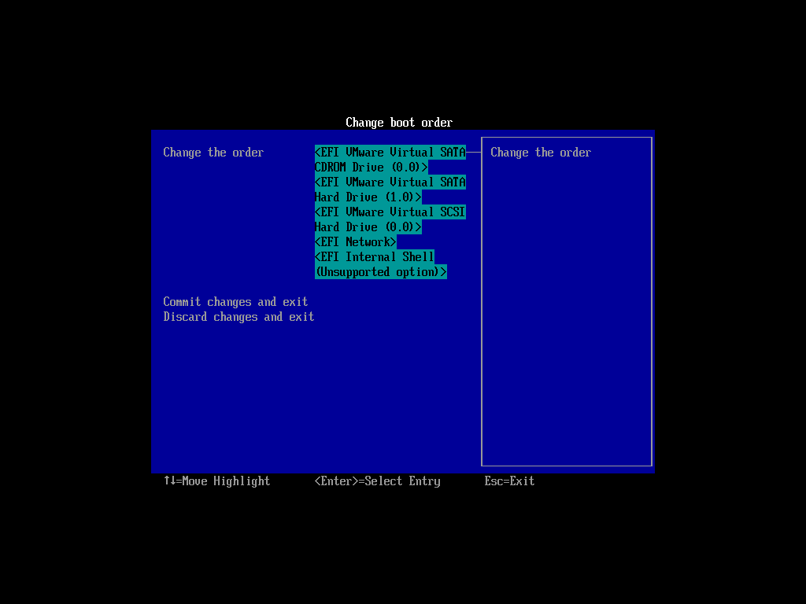

# One image to multiple disks

Restore an image to multiple disks, e.g. massive production of live USB flash drives.

# Boot the machine via Clonezilla live

In this example, the machine has 5 disks, 1st disk's name is sda (device name in GNU/Linux), 2nd disk's device name is sdb that has a Debian system we do not want to overwrite. There are 2 more blank internal hard drives, i.e., sdc and sdd. We already have a Clonezilla image in sde, the image name is called `bookworm-2023-10-15-03-img`.

Now the image `bookworm-2023-10-15-03-img` will be restored to **multiple disks, i.e. sda, sdc, and sdd** (Remember we want to keep sdb, do not overwrite it), which could be USB flash drives, external hard drives, or internal hard drives.

This is a typical example to do [massive live USB flash drives production](https://drbl.org/screenshot/?in_path=/12_Alvin_Su_Taiwan).

Once you have the bootable Clonezilla Live CD/DVD or USB flash drive, you can boot the machine you want to clone via Clonezilla live. **Remember to use the Clonezilla live CD or USB flash drive to boot the machine**. For example, if you have Clonezilla Live in USB flash drive, you have to boot it via USB device (Ex. USB-HDD or USB-ZIP). If necessary, you can set the first boot priority in the BIOS as USB-HDD or USB-ZIP so that it can boot Clonezilla Live from your USB flash drive.

Here we take CD as an example. You can either set CD as first boot priority in machine's BIOS like this:

Or by pressing a hotkey (e.g. `Esc` or `F9`) when you boot the machine, you will see the boot menu of BIOS like this:

Check your motherboard manual for more details about how to boot your machine via CD.

## The boot menu of Clonezilla live

Here is a screenshot of Clonezilla Live boot menu:

The first one is the default mode for Clonezilla Live. It will default to framebuffer mode with a resolution of 1024x768.

The 2nd one is for you to use large font, especially when you have 4K monitor. In addition to use the arrow key to choose, you can also press `l` to choose that.

The 3rd one is for the blind to use, which can be chosen by pressing `s` key.

There are more modes which you can choose in the 4th choice "Other modes of Clonezilla live", e.g. 800X600 or 640x480 one if you want, as shown here:

The choice, `Default settings, KMS` is for you to use [KMS (Kernel Mode Setting)](https://en.wikipedia.org/wiki/Kernel_mode-setting) for your graphics card. If you have some problem to use the framebuffer mode of your graphics card, you can try it.

The choice, `Clonezilla live (To RAM. Boot media can be removed later)`, is the same function with the 1st one except when Clonezilla live booting finishes, all the necessary files are copied to memory. Therefore you can remove the boot media (CD or USB flash drive) then.

If you do not need Chinese or Japanese environment or if your computer experiences problems in the framebuffer mode, you can choose the one `Clonezilla Live (no framebuffer)` to clone in the English environment.

The choice, `Clonezilla live (failsafe mode)`, is for something goes wrong when you are not be able to boot your machine, such as ACPI of your machine is not supported in the kernel.

If you want to boot local OS in your harddrive, you can choose the one `Local operating system in harddrive (if available)`. This is an extra function in the boot media that has nothing to do with Clonezilla Live.

The choice, `FreeDOS`, allows you to boot your machine into Free DOS. This is an extra function in the boot media that has nothing to do with Clonezilla Live.

The choice, `Memory test using Memtest86+`, is for memory testing using Memtest86+. This is an extra function in the boot media that has nothing to do with Clonezilla Live.

The choice, "Network boot via iPXE" is used to perform a network boot via iPXE. If your computer does not have a PXE network, you can use this to do boot from a network. This is an extra function in the boot media that has nothing to do with Clonezilla Live.
