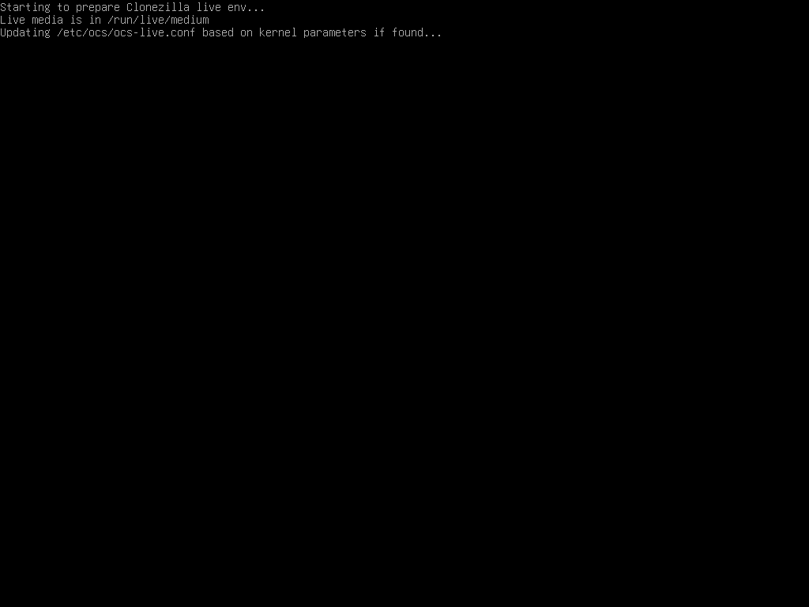
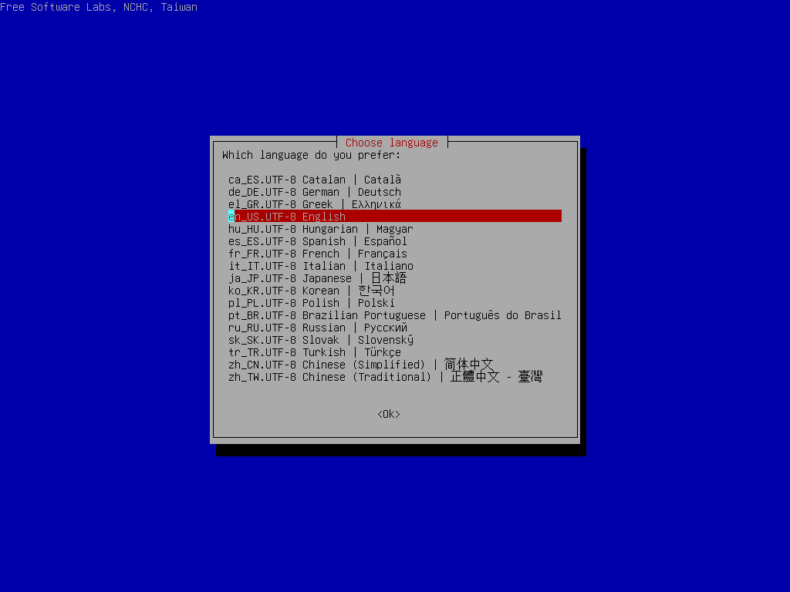
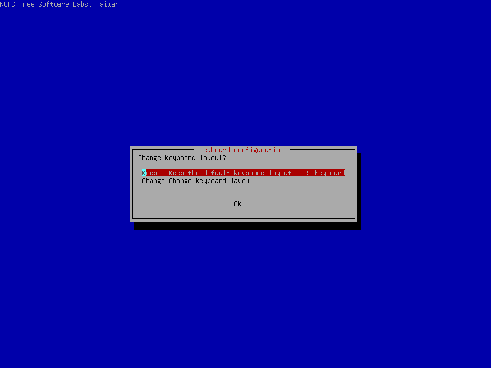
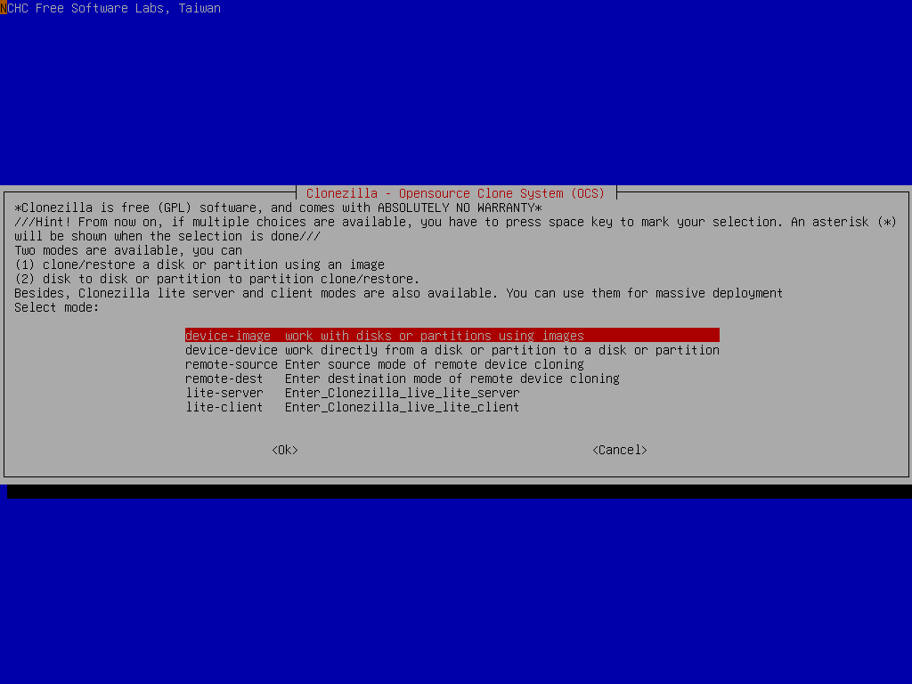
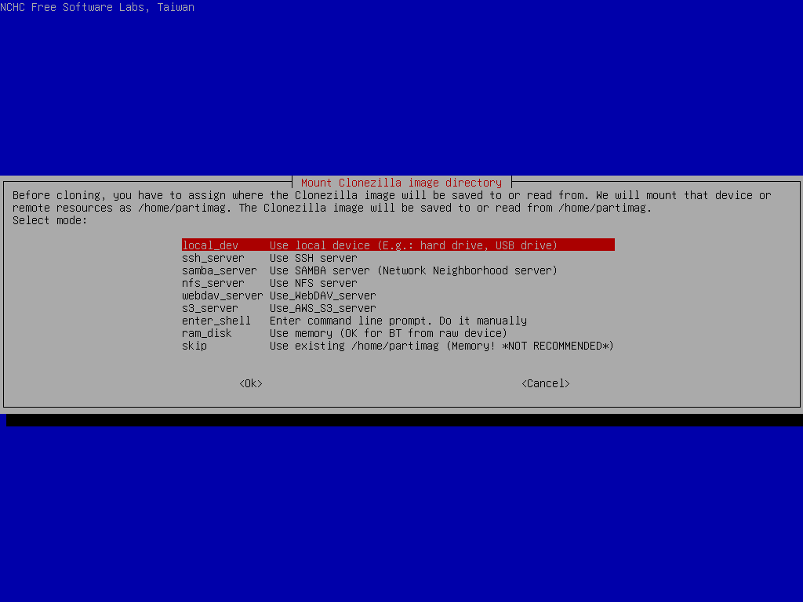
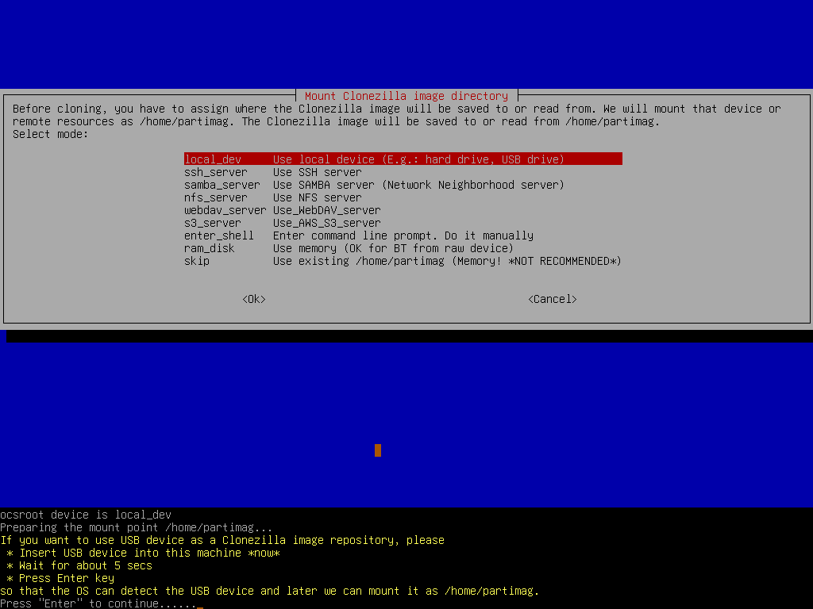
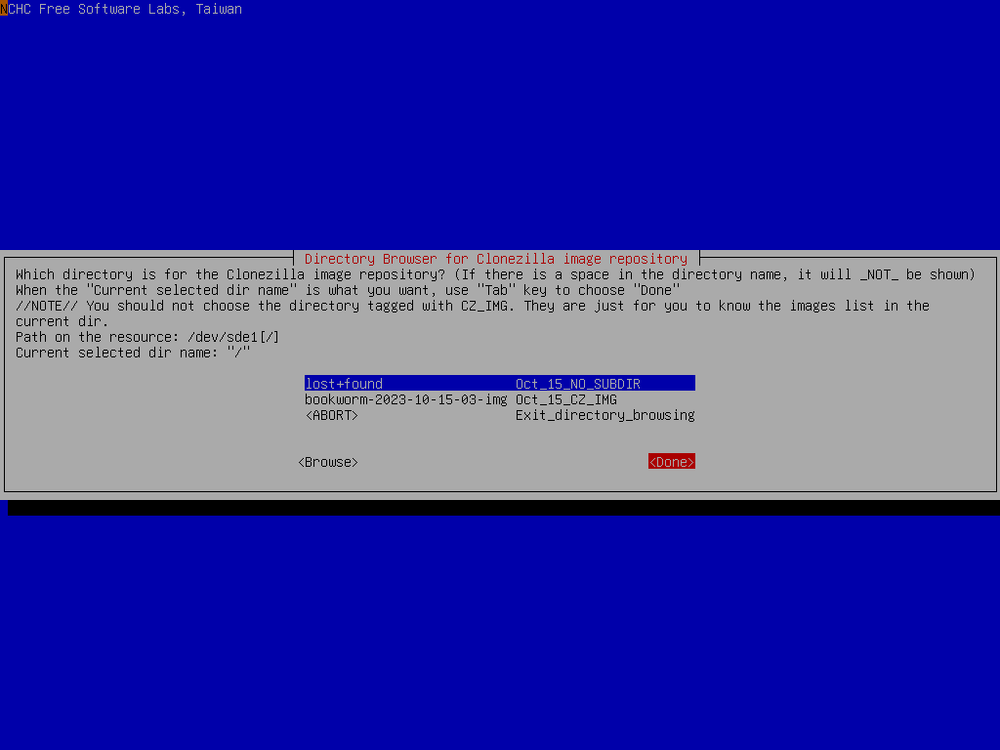
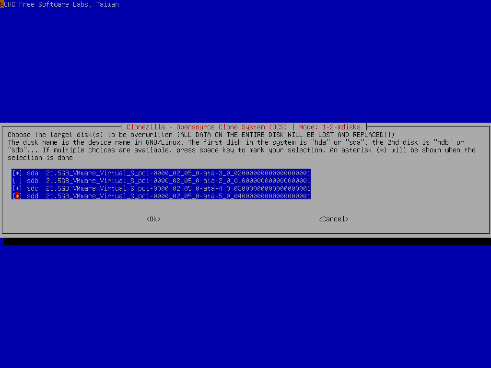

# One image to multiple disks

Restore an image to multiple disks, e.g. massive production of live USB flash drives.

## Boot the machine via Clonezilla live

In this example, the machine has 5 disks, 1st disk's name is sda (device name in GNU/Linux), 2nd disk's device name is sdb that has a Debian system we do not want to overwrite. There are 2 more blank internal hard drives, i.e., sdc and sdd. We already have a Clonezilla image in sde, the image name is called `bookworm-2023-10-15-03-img`.

Now the image `bookworm-2023-10-15-03-img` will be restored to **multiple disks, i.e. sda, sdc, and sdd** (Remember we want to keep sdb, do not overwrite it), which could be USB flash drives, external hard drives, or internal hard drives.

This is a typical example to do [massive live USB flash drives production](https://drbl.org/screenshot/?in_path=/12_Alvin_Su_Taiwan).

Once you have the bootable Clonezilla Live CD/DVD or USB flash drive, you can boot the machine you want to clone via Clonezilla live. **Remember to use the Clonezilla live CD or USB flash drive to boot the machine**. For example, if you have Clonezilla Live in USB flash drive, you have to boot it via USB device (Ex. USB-HDD or USB-ZIP). If necessary, you can set the first boot priority in the BIOS as USB-HDD or USB-ZIP so that it can boot Clonezilla Live from your USB flash drive.

Here we take CD as an example. You can either set CD as first boot priority in machine's BIOS like this:

Or by pressing a hotkey (e.g. `Esc` or `F9`) when you boot the machine, you will see the boot menu of BIOS like this:

Check your motherboard manual for more details about how to boot your machine via CD.

## The boot menu of Clonezilla live

Here is a screenshot of Clonezilla Live boot menu:

The first one is the default mode for Clonezilla Live. It will default to framebuffer mode with a resolution of 800x600.

The 2nd one `(VGA 800x600 & To RAM)`, is the same function with the 1st one except when Clonezilla live booting finishes, all the necessary files are copied to memory. Therefore you can remove the boot media (CD or USB flash drive) then. In addition to use the arrow key to choose, you can also press `r` to choose that.

The 3rd one `(VGA with large font & To RAM)` is for you to use large font, especially when you have 4K monitor, and it will all the necessary files will be copied to memory. In addition to use the arrow key to choose, you can also press `l` to choose that.

The 4th one `(Speech synthesis)` is for the blind to use, which can be chosen by pressing `s` key.

There are more modes which you can choose in the 5th choice `Other modes of Clonezilla live`, e.g. 1024X768 or 640x480 one if you want, as shown here:

The choice, `KMS` is for you to use [KMS (Kernel Mode Setting)](https://en.wikipedia.org/wiki/Kernel_mode-setting) for your graphics card. If you have some problem to use the framebuffer mode of your graphics card, you can try it.

If you do not need Chinese, Japanese or Korean environment or if your computer experiences problems in the framebuffer mode, you can choose the one `Clonezilla Live Safe graphic settings (vga=normal)` to clone in the English environment.

The choice, `Clonezilla live (Failsafe mode)`, is for something goes wrong when you are not be able to boot your machine, such as ACPI of your machine is not supported in the kernel.

If you want to boot local OS in your hard drive, you can choose the one `Local operating system in hard drive (if available)`. This is an extra function in the boot media that has nothing to do with Clonezilla Live.

The choice, `Memtester (VGA 800x600 & To RAM)` is for memory testing using [Memtester](https://github.com/jnavila/memtester). This is an extra function in the boot media that has nothing to do with Clonezilla Live.

The choice, `Memory test using Memtest86+`, is for memory testing using [Memtest86+](https://www.memtest.org/). This is an extra function in the boot media that has nothing to do with Clonezilla Live.

The choice, `Network boot via iPXE` is used to perform a network boot via [iPXE](http://ipxe.org/). If your computer does not have a PXE network, you can use this to do boot from a network. This is an extra function in the boot media that has nothing to do with Clonezilla Live.

The choice, `uEFI firmware setup` is used to enter uEFI BIOS settings.

## Here we choose 800x600 mode, after pressing Enter, you will see Debian Linux booting process

## Choose language

## Choose keyboard layout

The default keyboard layout is US keyboard, therefore if you are using US keyboard, just press enter (i.e. use the option `Keep`).

If you want to change keymap, you can choose `Change` then follow the dialog to change it.

## Choose `Start Clonezilla`

## Choose `device-image` option

Pay attention to the hints, too. You might need that:

> [!INFO] Hint<!-- eslint-disable-line markdown/no-missing-label-refs -- GitHub alerts -->
> From now on, if multiple choices are available, you have to press space key to mark your selection. A star sign (\*) will be shown when the selection is done.

## Choose `local_dev` option to assign sde1 as the image home

There are other options, e.g. sshfs, samba, nfs or [webdav](https://en.wikipedia.org/wiki/WebDAV), [AWS S3](https://en.wikipedia.org/wiki/Amazon_S3) or [Openstack Swift](https://en.wikipedia.org/wiki/OpenStack), you can use when network is available. This is very useful when 2nd local disk is not available.

Since we choose `local_dev` option, we can use 2nd disk or USB flash drive to save 1st disk's image. If using USB flash drive as repository, insert USB flash drive and wait a few secs.

Clonezilla will scan the disks on the machine in every few secs, and show you the results:

Once you see the device you have inserted shown on the status, you have to press `Ctrl-C` to quit the scanning report.

## Select sde1 as image repository, then choose `1-2-mdisks` option

Before mounting the device sde1, it allows you to do a file system check. Here we skip it.

Choose the directory name on /dev/sde1 as the image repository. Here we put image on the top directory (i.e., Current selected dir name is `/`). Use `Tab` key to choose `Done` then press `Enter` to accept the image repository:

If you are not familiar with the disk or partition name in GNU/Linux, read the hints:

> [!INFO] Hint<!-- eslint-disable-line markdown/no-missing-label-refs -- GitHub alerts -->
> The partition name is the device name in GNU/Linux. The first partition in the first disk is `sda1`, the 2nd partition in the first disk is `sda2`, the first partition in the second disk is `sdb1`... If the system you want to save is MS Windows, normally C: is sda1, and D: could be sda2, or sda5...

Then Clonezilla shows you the disk usage report:

Here we choose `Beginner` mode:

If you choose `Expert` mode, you will have some chances to choose advanced parameters, e.g. imaging program, compression program, etc.. You can see more details [here](#the-advanced-parameters-for-restoring-one-image-to-multiple-disks).

### The advanced parameters for restoring one image to multiple disks

::: details Click to view the content
Select advanced parameters

Choose the extra parametrs you want. Here we just press `enter` to accept the default settings:

Choose the option `-k0` (Use the partition table from image)

If the target disk size is larger than the size of source disk of image, you can try to use option `-k1` which will create the partition table proportionally in the target disk and turn on option `-r` to resize the file system in the partition automatically. This is useful to make use all of the target disk size.

**ISSUE: FAQ/Q&A link missing**

For more details about the advanced parameters of Clonezilla live, please check this [FAQ/Q&A](http://drbl.org/faq/fine-print.php?path=./2_System/88_mbr_related_options.faq#88_mbr_related_options.faq).
:::

Now you can select `1-2-mdisks` option:

Now Clonezilla prompts you to insert destination USB flash drives if you haven't done that:

## Select image name and destination disk

Choose the Clonezilla live image as source image:

Select the destination disks `sda`, `sdc`, and `sdd` we want to restore:

> [!INFO] Note<!-- eslint-disable-line markdown/no-missing-label-refs -- GitHub alerts -->
> Be careful when choosing the destination disks. Everything on the destination disks will be overwritten.

Choose to check the image integrity before really restoring the image to disk sda:

It's recommended to check the image before restoring it. You will not know if the image is broken or not. If you are really sure about the integrity is OK, then of course you can choose `-scr` to skip checking.

Select the mode you want after the image restoring is done:

By default we will choose later, but if you have decided, you can choose to reboot or poweroff the machine.

Clonezilla will prompt us the command to restore the image. This command is very useful when you want to create a customized Clonezilla live, or to do a massive production of live USB flash disks:

Before starting to restore the disk image to destination disks, Clonezilla will ask you to confirm that TWICE:

## Clonezilla is restoring disk image on disk sde to sda, sdc, and sdd

Clonezilla now is restoring the selected disk image to destination disks. The job is done by restoring:

- MBR (by dd), and Boot loader (by grub)
- Partition table (by sfdisk).
- Data on every partition or LV (logical volume) (by partimage, ntfsclone, partclone or dd. It depends on the image of each partition or LV.)

When everything is done, you can choose to:

- Poweroff
- Reboot
- Enter command line prompt
- Start over (image repository /home/partimag, if mounted, will be umounted)
- Start over (keep image repository /home/partimag mounted)
- Start over (Remount subdir in medium of current repository)

Here we choose `poweroff`, then when the shutdown process is done, it will ask you to remove the disk and close the try (if any) then press `ENTER` if you boot Clonezilla live from CD. If you boot Clonezilla live from USB flash drive, then there is no such prompt.

That's all. The destination disks (sda, sdc, sdd) are ready to be used.
